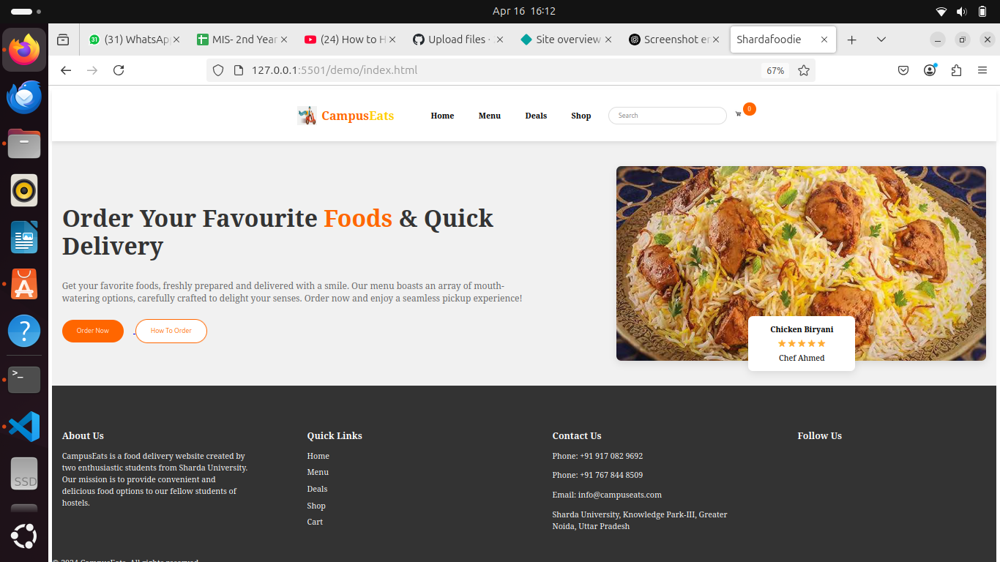
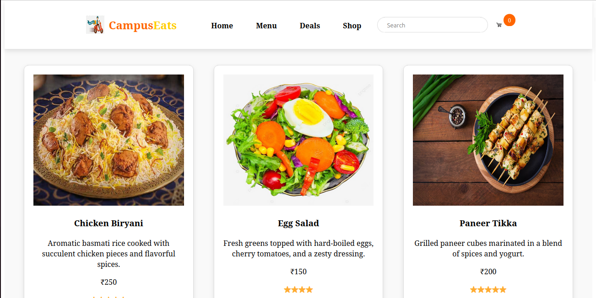
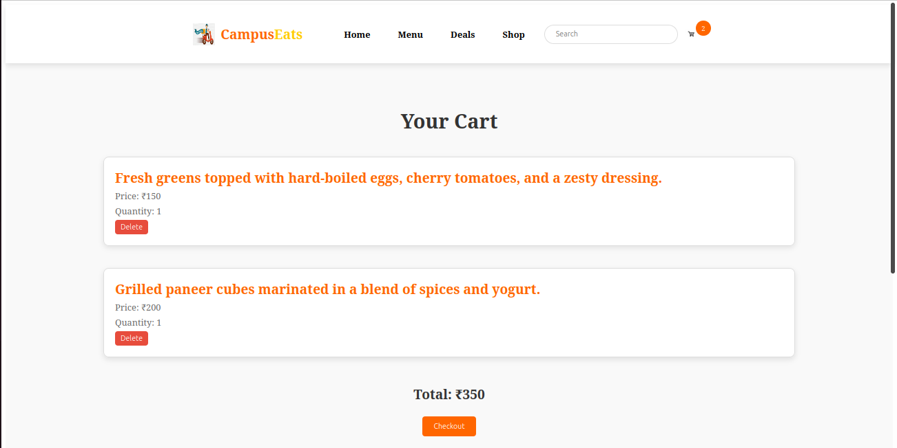

🍔 Demo Restaurant Web App

A fully functional and visually appealing restaurant website built using HTML and CSS, designed to simulate the user journey from browsing the menu to placing an order.
📋 Features

    🛍️ Interactive Menu Page

    🧾 Order & Checkout Flow

    👤 User Registration & Login Pages

    💳 Payment and Confirmation Pages

    🎯 Simple, clean, and responsive design

📁 Project Structure

demo/
├── index.html               # Homepage
├── menu.html                # Menu listings
├── order.html               # Order page
├── deals.html               # Special offers
├── login.html               # Login page
├── registered-user.html     # Logged-in user dashboard
├── new-user-step1.html      # Registration Step 1
├── new-user-step2.html      # Registration Step 2
├── checkout.html            # Checkout process
├── payment.html             # Payment form
├── confirmation.html        # Order confirmation
├── shop.html                # Product listings
├── styles.css               # Main styling
├── style.css                # Additional/alternate styles

📸 Images

You can add screenshots of the site here to showcase different pages or features.

HOMEPAGE

MENUPAGE

CHECKOUT
    📁 To use this:
    Create a folder named images in your repo root, and place your screenshots there using the matching filenames above.

🚀 Getting Started

    Clone the repository:

    git clone https://github.com/your-username/demo-restaurant-website.git
    cd demo

    Open index.html in your browser.
    No backend setup needed — it's all front-end.

🛠 Future Improvements

    Add JavaScript for interactivity (form validation, animations)

    Backend integration (Node.js, Firebase, etc.)

    Cart and user authentication system

📄 License

This project is open-source under the MIT License.
